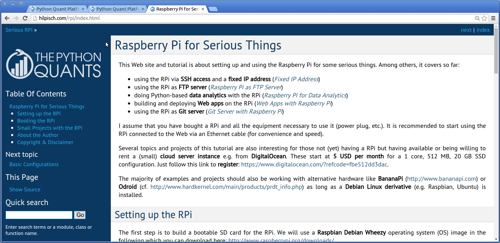

# Raspberry Pi for Serious Things

It is almost more than a year ago that I bought my first Raspberry Pi (cf. http://raspberrypi.org). Apart from being a "nice toy", the RPi can be used for some serious things.

This "little year end pet project" of mine is a try to cover a set of topics that might be of interest to those who want to use the RPi for such things like:

* SSH access to your RPi "server"
* data analytics with Python
* Web app deployment
* RPi as FTP server or
* Web cam surveillance

The current version of the  tutorial is found under http://hilpisch.com/rpi/index.html.

Would love to hear your feedback under github@hilpisch.com.
