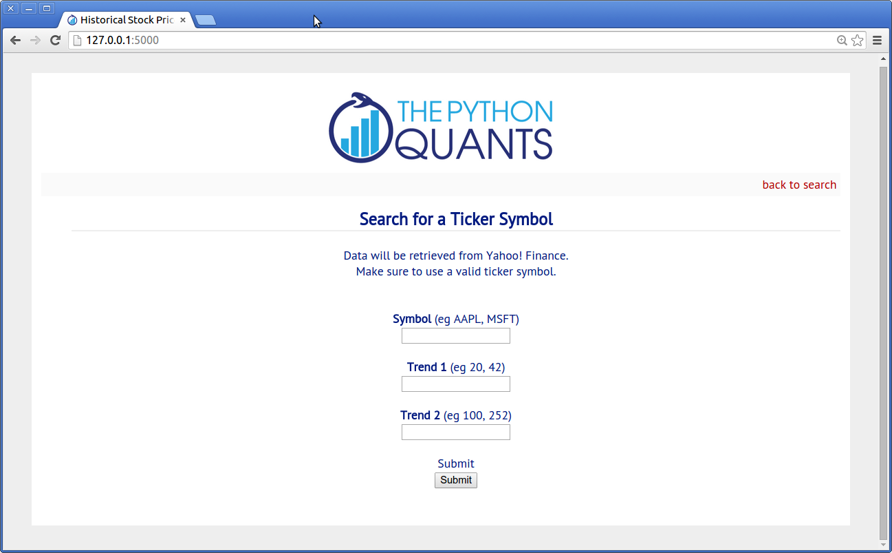

.. _web_apps:

Web Apps with Raspberry Pi
-------------------------------

Having implemented the small project about data analytics with Python, we are now well equipped to do something useful with the data analytics capabilities. In particular, we want to build a small **Web app** that serves a page where you can decide on a ticker symbol and you get back historical stock price data for that symbol.

The framework we are going to use is called **Flask** (cf. http://flask.pocoo.org/) and has become quite popular recently in the Python world. Installation in this case is straightforward::

    sudo pip install Flask
    sudo pip install flask-wtf

To get our Web app to be build served, we need a **Web server**. A popular choice in the Python world is **Tornado** (cf. http://www.tornadoweb.org/en/stable/). Install it via::

    sudo pip install tornado

This should also be quick and straightforward. This is almost all we need to use the RPi as a Web server for Web sites or applications.

A First Example
^^^^^^^^^^^^^^^^^^

Let us see if we can implement the **"Hello World!" example** of Flask and get it served with Tornado. First the Web app itself:

.. literalinclude:: flask_test.py

As you see, a few lines of code suffice for a propor Web application---even if it is only a very small one. The :download:`download link<./flask_test.py>` for this Python module.

Next, we need to wrap the app into a **WSGI container** (cf. http://en.wikipedia.org/wiki/Web_Server_Gateway_Interface) to be served by Tornado:

.. literalinclude:: web_serve.py

Again only a few lines of code. The :download:`download link<./web_serve.py>` for this script. If you execute this last script via::

    python web_serve.py

you should be able to see the result when going to the **fixed IP or domain of your RPi** in combination with port 5000 (cf. :ref:`fixip`)::

    http://xx.yy.zz.100:5000

or::

    http://rpi.mydomain.net:5000

Historical Stock Price Data
^^^^^^^^^^^^^^^^^^^^^^^^^^^^^

This Web application retrieves historical stock price data for a user given **ticker symbol** and calculates **two different trends (moving averages)**. It then outputs a figure with the data and results as well as a HTML table with the raw data.

Let us start with the **Web app code** itself:

.. literalinclude:: ./stock_app/stock_data.py

The :download:`download link<./stock_app/stock_data.py>` for this Python script.

We need a simple **WTF form** for data input (:download:`download link<./stock_app//forms.py>`)

.. literalinclude:: ./stock_app/forms.py

The major **layout template** (:download:`download link<./stock_app/templates/layout.html>`:

.. literalinclude:: ./stock_app/templates/layout.html
    :language: html

The sub-template for the **data input** (:download:`download link<./stock_app/templates/selection.html>`):

.. literalinclude:: ./stock_app/templates/selection.html
    :language: html

And the sub-template for the **results output** (:download:`download link<./stock_app/templates/results.html>`):

.. literalinclude:: ./stock_app/templates/results.html
    :language: html

Also, a bit of **CSS** styling (:download:`download link<./stock_app/static/style.css>`)

.. literalinclude:: ./stock_app/static/style.css
    :language: css

Finally, the **Tornado WSGI wrapper** for the app (:download:`download link<./stock_app/run_stock_app.py>`):

.. literalinclude:: ./stock_app/run_stock_app.py

All these files should be placed in the following **folder structure**:

.. ipython:: python

    import os

    for path, dirs, files in os.walk('./source/stock_app'):
        print path
        for f in files:
            print f

When the working directory is ``stock_app``, the following command then runs the Web app::

    python run_stock_app.py

You should now be able to access the Web application via (cf. :ref:`fixip`)::

    http://xx.yy.zz.100:8888

or::

    http://rpi.mydomain.net:8888

The **starting/main page** for the data input might then look like (here the app is run locally):

The **results output page** looks like this:

.. image:: stock_app_results.png
    :scale: 66%

Generating Interactive D3 Plots
^^^^^^^^^^^^^^^^^^^^^^^^^^^^^^^^^^^

Modern Web applications generally rely on **nicely rendered, interactive graphics**. The following example slightly adjusts the previous one to accomplish exaclty that. The main tool used here is **plotly** (cf. http://plot.ly), a graphics engine that allows to easily transform static Python/matplotlib plots into interactive **D3.js** plots (http://d3js.org/) or to directly generate such plots from Python.

You need to **install plotly** as follows::

    sudo pip install plotly

You also need to create an account on the Web site http://plot.ly.

The major **changes** have be made in the main application module (:download:`download link<./stock_int/stock_interactive.py>`):

.. literalinclude:: ./stock_int/stock_interactive.py

We also need to **adjust the results output template file** (:download:`download link<./stock_int/templates/plotly.html>`):

.. literalinclude:: ./stock_int/templates/plotly.html
    :language: html

Also, the **WSGI wrapping** is to be adjusted slightly (:download:`download link<./stock_int/run_stock_int.py>`):

.. literalinclude:: ./stock_int/run_stock_int.py

Everything else remains the same. Your **folder structure** should now look like follows:

.. ipython:: python

    for path, dirs, files in os.walk('./source/stock_int'):
        print path
        for f in files:
            print f

If everything runs as desired, the **results page** of the interactive version should look like below (here the app runs locally):

.. image:: stock_app_plotly.png
    :scale: 66%